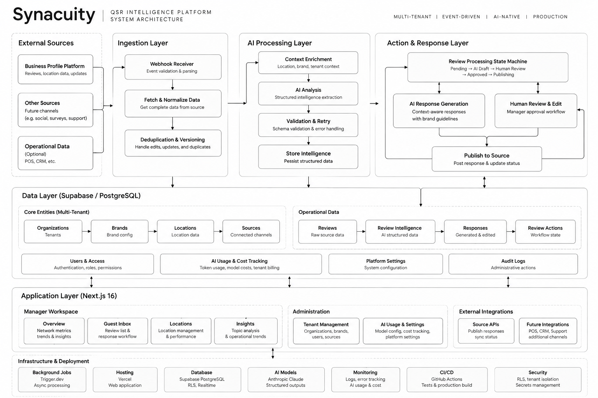

# Synacuity

AI-native intelligence and action layer for multi-location restaurant chains.

> **Source-free showcase.** Production source code is maintained privately under a client IP agreement. This repository documents the architecture, engineering decisions, and system design.

---

## What it does

Large restaurant chains get thousands of guest reviews every month across hundreds of locations. Nobody reads them all. Nobody connects them to operational patterns. Responses get drafted manually or skipped entirely.

Synacuity ingests reviews continuously, runs structured AI analysis on each one, surfaces location-level patterns and priorities, and routes responses through a human-approval workflow before anything gets published back to Google.

Current deployment: enterprise QSR chain, 2,400+ locations across two markets.

---

## How this is different

Birdeye, Chatmeter, and Momos solve the review management problem well.
That market is mature.

Synacuity is built on a different assumption: reviews are a structured
signal source, not a support queue. The platform runs structured extraction
on every review, builds location-level intelligence from the patterns, and
routes action through a human-approval workflow before anything goes public.

A Birdeye user sees reviews and responds. A Synacuity user sees which 12
of their 400 locations are trending negative on service speed this week,
why, and what to do about it.

---

## Architecture



---

## Production numbers

| | |
|--|--|
| Locations monitored | 3,800+ across US and Pakistan |
| Reviews processed | 15,000+ |
| AI analysis records | 12,000+ |
| AI cost per 1,000 reviews | ~$5.40 |
| Pipeline latency | under 2 minutes end-to-end |

---

## Stack

**Frontend**
- Next.js 15 App Router + TypeScript
- Tailwind CSS v4 + shadcn/ui
- TanStack Table v8 (server-side pagination + filtering)
- Recharts
- Zustand + TanStack Query
- Supabase Realtime

**Backend**
- Next.js Route Handlers
- Trigger.dev v4 (background jobs, scheduled tasks, retry logic)
- Supabase PostgreSQL with RLS on every table
- Zod end-to-end

**AI**
- Claude Sonnet (claude-sonnet-4-6)
- 1h ephemeral prompt caching on static instruction blocks
- Per-call cost tracking (input, output, cache read, cache write tokens)

**Infrastructure**
- Google Business Profile API v4
- Google Cloud Pub/Sub (real-time review notifications)
- Vercel
- Trigger.dev Cloud

---

## Database

17 tables, multi-tenant from day one. Organized around canonical entities:
organizations, brands, locations, reviews, intelligence, actions, responses,
and audit trail. Every table carries an organization identifier — enforced
at the database layer via RLS, not just application code.
```

---

## Engineering decisions worth explaining

**1. Pub/Sub notification triggers a fresh GBP API fetch**

The Pub/Sub payload tells us something changed. We do not use the payload as the review data. We fetch the authoritative review from GBP API separately. This avoids stale or partial data from notification delivery.

**2. is_current versioning on reviews**

When Google updates a review, we do not overwrite the existing row. We set the old row as non-current and insert a new version. Dashboard queries always read the current version only. Full history is preserved for audit.

**3. Canonical review identity vs integration metadata**

Our internal review ID is the canonical identity. External platform IDs (Google, Yelp, TripAdvisor) are integration metadata stored in a separate mapping table. Adding a new source means adding a connector and a mapping row, not touching the reviews table structure.

**4. AI cost frozen at call time**

Pricing is stored in a versioned table. When we call Claude, we look up the current pricing row and store the cost on the usage record at that moment. If Anthropic changes pricing later, historical cost records are not affected.

**5. Prompt caching on intelligence calls**

The static system instruction block is cached with a 1h TTL. For high-volume review processing, cache hits on the instruction block significantly reduce per-call cost. Cache tokens are tracked separately from regular input tokens.

**6. Trigger.dev over n8n**

Started with n8n for the initial prototype. Replaced it with Trigger.dev v4 once the pipeline needed proper TypeScript types, structured retry logic, task observability, and reliable scheduling. n8n was fine for wiring things together quickly. It was not the right tool for a production pipeline processing thousands of reviews.

**7. RLS at the database layer**

Row-level security is enforced in Postgres, not just in application code. Every table carries an organization identifier. A misconfigured API route cannot accidentally leak one tenant's data to another.

**8. Human approval before any publish**

The state machine has an explicit approval gate. AI drafts sit there until a manager takes action. The system cannot move to publishing without an explicit human action. This is not a configuration option.

---

## What the AI extracts from each review

Each review goes through a structured extraction pass. The output covers:

- Sentiment classification with confidence score
- Topic identification (primary + secondary)
- Issue type and severity
- Service channel detection
- Customer intent signals (return intent, requested action)
- Escalation and recovery signals
- Competitor mentions
- Priority scoring with action recommendation
- Positive and negative signal extraction

These are guest voice signals at the MVP stage. The schema is designed so future domains (Operations, Competitive, Recovery, Campaign) can consume them without migration.

---

## Action state machine

```
pending
  ai_draft_ready
    awaiting_approval
      approved          (manager approves AI draft)
      edited            (manager edits AI draft)
      regenerated       (manager requests new AI draft)
      manager_written   (manager writes from scratch)
        ai_audit        (all four paths go through audit)
          approved_final
            publishing
              published
              publish_failed
```

Every response, regardless of origin, goes through AI audit before publish. Audit checks: overall score (0-100), brand fit, issue addressed, tone, empathy, accuracy, risk level, suggested improvement.

---

## What this is not

Not a review reply generator. Not a chatbot. Not a CRM. Not hardcoded to one restaurant brand.

The core idea is that guest reviews are a structured signal source, not a support queue. The platform treats them that way.

---

## Intelligence domains

| Domain | Status |
|--------|--------|
| Guest Voice Intelligence | built |
| Reputation Intelligence | built |
| Location Intelligence (review-derived) | built |
| Executive / Network Overview | built |
| AI Response + Action Center | built |
| Unified Customer Intelligence | data model ready |
| Operations Intelligence | roadmap |
| Campaign Intelligence | roadmap |
| Competitive Intelligence | roadmap |
| Local Presence / AI Search | roadmap |
| Revenue Intelligence | roadmap |
| Predictive Intelligence | roadmap |
| Customer Recovery | roadmap |

---

## Business

Synacuity LLC, Texas. Production MVP with enterprise client deployed. Target market: multi-location QSR and fast-casual groups. Pricing: platform subscription per location. Live at [app.synacuity.com](https://app.synacuity.com).

---

## Source code

Private repository, client IP agreement. Available for review during technical interviews.

[hamid@xcerlabs.com](mailto:hamid@xcerlabs.com) / [hamid.xcerlabs.com](https://hamid.xcerlabs.com)
